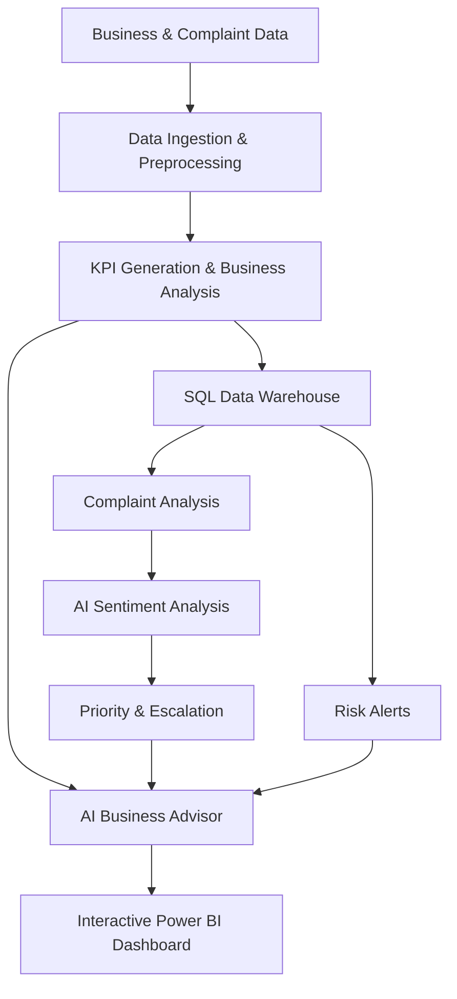

# AI-Powered Business Health Monitoring System

An AI-powered business intelligence system designed to monitor business performance, analyze customer complaints, identify operational risks, and generate actionable business insights.

## Problem Statement

Businesses often struggle to monitor sales, profitability, customer complaints, and operational risks across large datasets. Manual analysis is time-consuming and makes it difficult to identify important business issues quickly.

## Proposed Solution

The system combines automated data processing, KPI generation, SQL-based data storage, AI-powered complaint analysis, business intelligence, and interactive visualization to provide a centralized view of overall business health.

## System Workflow

## Key Features

* Automated data ingestion and preprocessing
* Business KPI generation
* Revenue, profit, customer, and product analysis
* Regional and category performance analysis
* Sales trend analysis
* Customer complaint monitoring
* AI-based sentiment analysis
* Complaint categorization and prioritization
* Escalation queue generation
* Business risk alerts
* Centralized SQL data storage
* AI Business Advisor
* AI Business Agent
* Interactive Power BI dashboard

## Datasets

### Superstore Dataset

Used for:

* Revenue and profit analysis
* Customer analytics
* Product performance
* Regional performance
* Sales trend analysis
* Risk analysis

### Store Complaints Dataset

Used for:

* Complaint monitoring
* Sentiment analysis
* Complaint categorization
* Priority assignment
* Escalation analysis
* Service quality analysis

## Technology Stack

* Python
* Pandas
* SQL / SQLite
* Power BI
* Matplotlib / Plotly
* Groq API
* Llama (via Ollama)

## Key Outcomes

* Automated business performance monitoring
* Faster identification of business risks
* AI-powered customer complaint analysis
* Intelligent complaint prioritization and escalation
* Improved operational visibility
* Centralized business data management
* AI-generated business insights and recommendations
* Interactive visualization of overall business health

## Project Status

**Completed**

Developed by **Janvi Chawla**
Manipal University Jaipur
